# Can Data Science help us find what makes a hit television show? 


## What constitutes a hit television show like few of these? 
### Questions I asked and investigated through Data Science.

* Is it the consistency in the way individual Characters speak and behave?
* Is it the repeat shots at locations thereby making your audience feel like they know the place over time?
* Is it the similarity/difference in the way different Characters speak and behave?
* Is it the balanced distribution of emotions like joy, sadness, fear, anger, disgust etc. which makes a show interesting?
* Is it the similar/different personality of Characters that keeps the audience connected?
* Is it the interesting flashbacks which binds the audience? 

## Data Availability

* Are datasets available to do this analysis? No

What I got after extensively searching the internet, was the html transcripts from the following URLs.

* Friends - https://fangj.github.io/friends/ - 10 seasons
* The Big Bang Theory – https://bigbangtrans.wordpress.com/ - 10/12 seasons
* Breaking Bad - https://en.wikiquote.org/wiki/Breaking_Bad – 5 seasons (with missing data)

Following is a sample of what these transcripts look like.


Following is a brief illustration of how I prepared dataset for modeling from raw html transcripts.


After I run the above steps, I get my dataset for each sitcom ready to be used for modeling. It took some significant effort on my part to generate these datasets. So, I uploaded them on Kaggle so that they can be used by the interested parties.


https://www.kaggle.com/shilpibhattacharyya/friends-sitcom-dataset


https://www.kaggle.com/shilpibhattacharyya/the-big-bang-theory-dataset


https://www.kaggle.com/shilpibhattacharyya/breaking-bad-sitcom-dataset

I am using **Watson Natural Language Understanding (NLU)** for emotion detection of the characters. Natural Language Understanding is a collection of APIs that offer text analysis through natural language processing. This set of APIs can analyze text to help you understand its concepts, entities, keywords, sentiment, and more. 

 

## Emotion distribution of the Characters on F.R.I.E.N.D.S.
 
## Emotion distribution of the Characters on The Big Bang Theory
 
## Emotion distribution of the Characters on Breaking Bad
 

I have introduced a variable 'emotion qotient' to understand which emotion is most prominent with respect to other emotions on the show. I have defined it as follows:

```
Individual_Emotion_Quotient = Individual_Emotion_Score/Total_Emotion_Score
```

Following are the scattered plot results.
## Emotion Quotient of the Characters on F.R.I.E.N.D.S. 
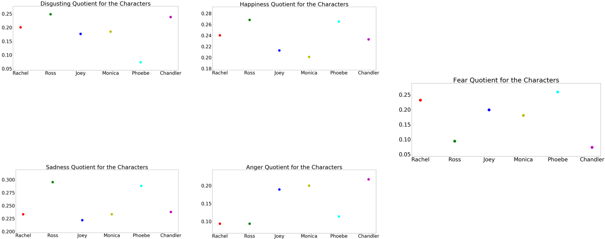
```Happiness and Sadness are the key emotions of the Characters```

## Emotion Quotient of the Characters on The Big Bang Theory
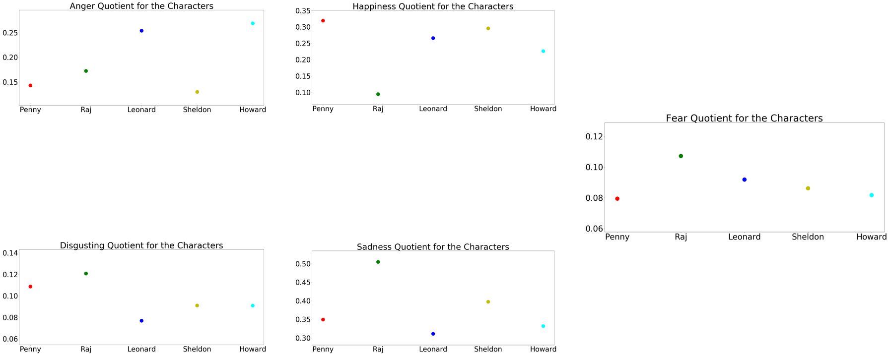
```Happiness is most dominant emotion of the Characters in the show```

## Emotion Quotient of the Characters on Breaking Bad
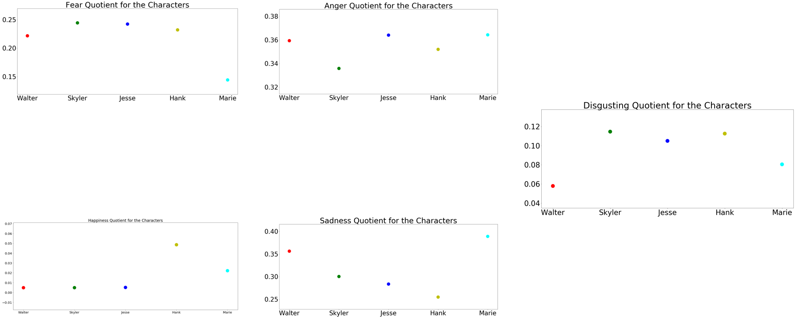
```Sadness and Anger are the key emotions of the Characters```

## Sentiment Density of Characters on F.R.I.E.N.D.S.
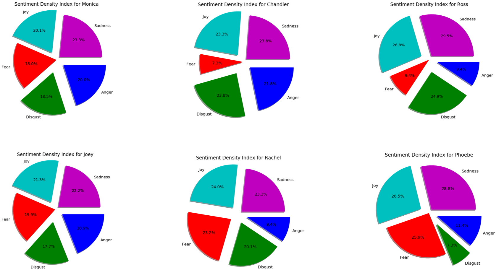
```All the Characters are biased towards joy and sadness```

## Sentiment Density of Characters on The Big Bang Theory
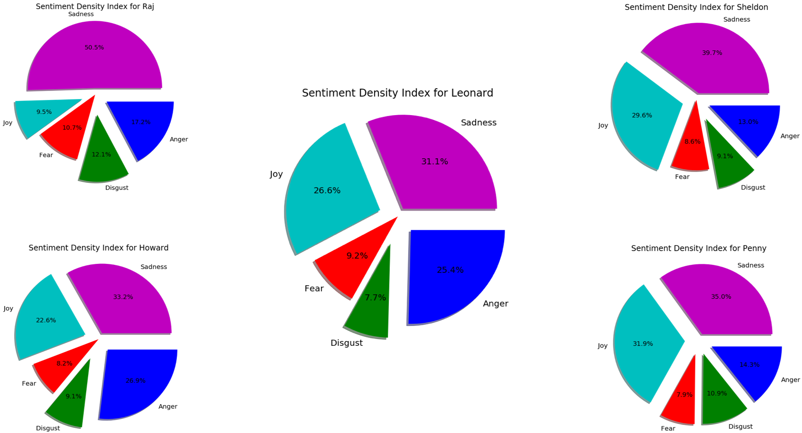
```All the Characters are biased towards sadness```

## Sentiment Density of Characters on Breaking Bad
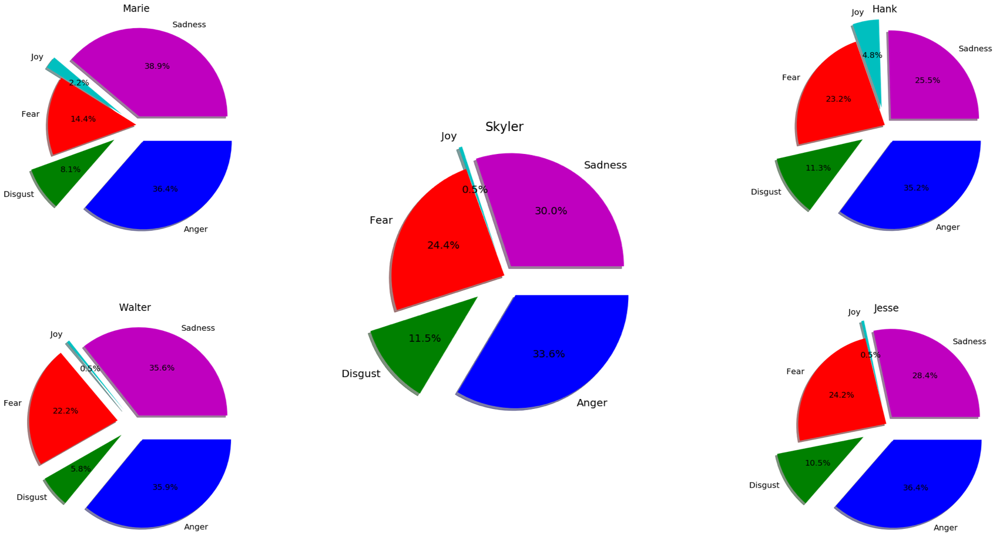
```All the Characters are biased towards sadness and anger```

I am using **Watson Personality Insights** to investigate the personality of each of the lead characters on the show.
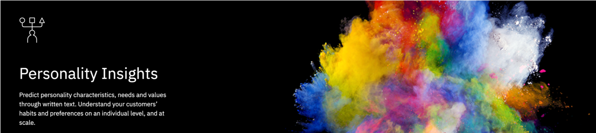
We would go for the big 5 traits from WPI defined as below here.

1. **Agreeableness**  compassionate and cooperative toward others.
2. **Conscientiousness**  act in an organized or thoughtful way.
3. **Extraversion**  seek stimulation in the company of others.
4. **Emotional range**  the extent to which a person's emotions are sensitive to the person's environment.
5. **Openness** the extent to which a person is open to experiencing different activities.

The IBM Watson Personality Insights service uses linguistic analytics to extract a spectrum of cognitive and social characteristics from the text data that a person generates through blogs, tweets, forum posts, and more. Watson found Trump "boisterous."

## Personality Insights for the Characters on F.R.I.E.N.D.S.
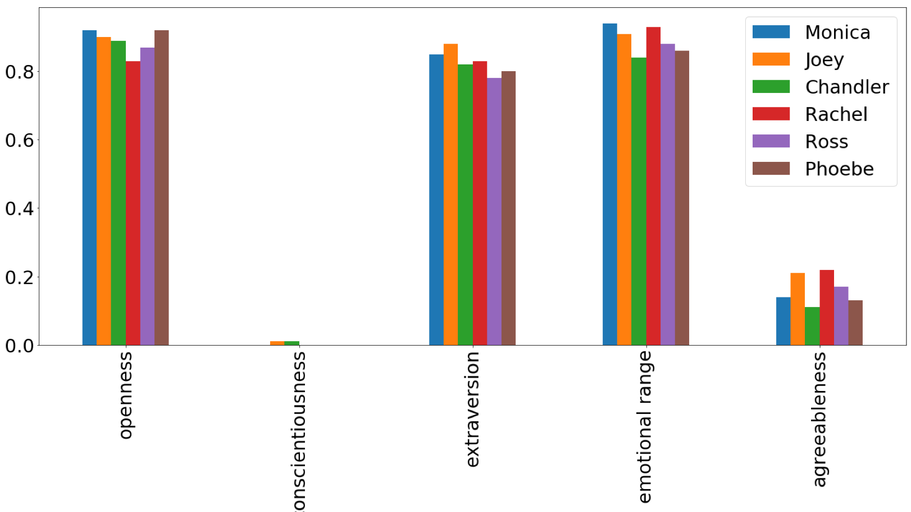
The personalities of all the characters on the show are similar
## Personality Insights for the Characters on The Big Bang Theory
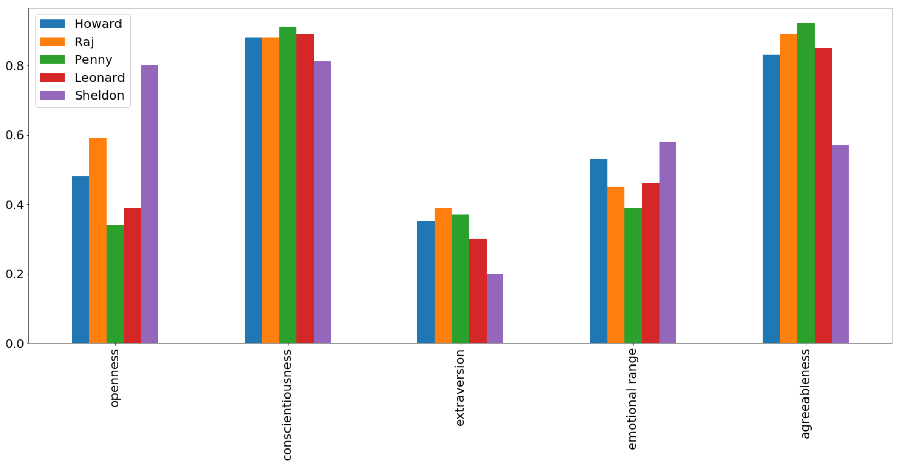
The personalities of all the characters on the show are nearly similar
## Personality Insights for the Characters on Breaking Bad
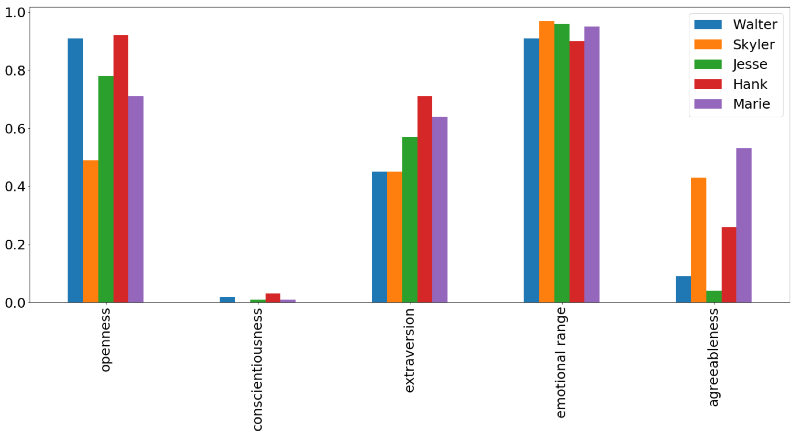
The personalities of all the characters are not quite similar

## Personality Density of the Characters on F.R.I.E.N.D.S.
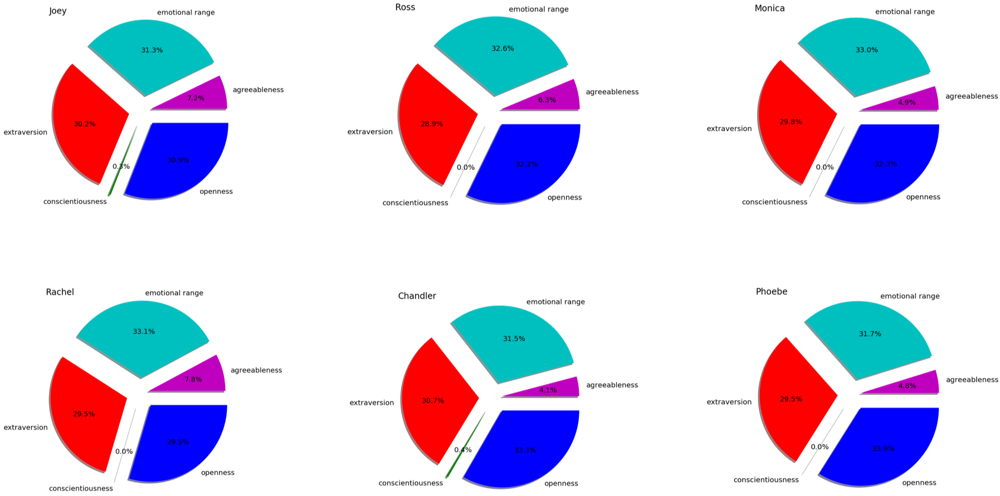
The personalities of all the characters have a similar distribution of attributes
## Personality Density of the Characters on The Big Bang Theory
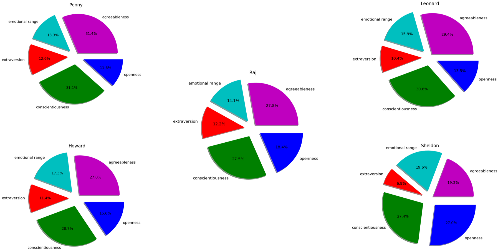
The personalities of all the characters have a similar distribution of attributes
## Personality of the Characters on Breaking Bad
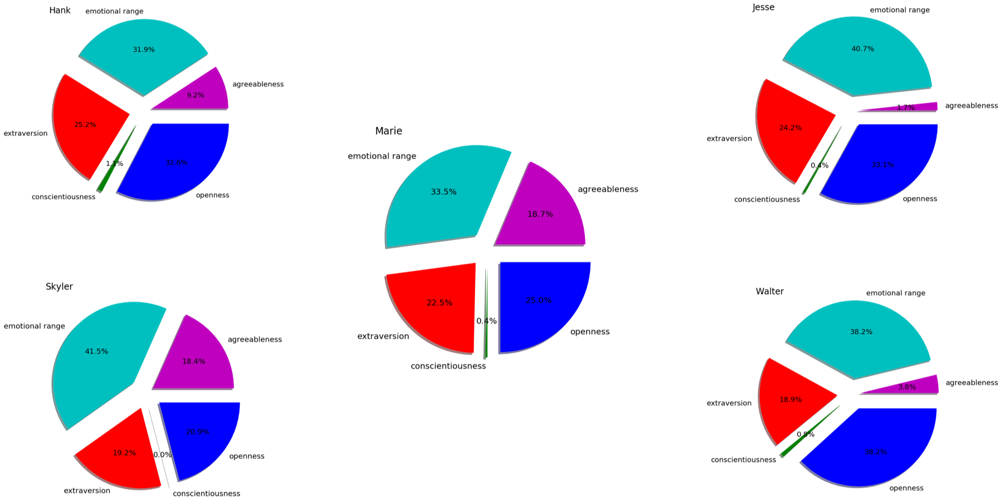
The personalities of all the characters have a similar distribution of attributes

## What are the top 5 locations F.R.I.E.N.D.S. was shot?
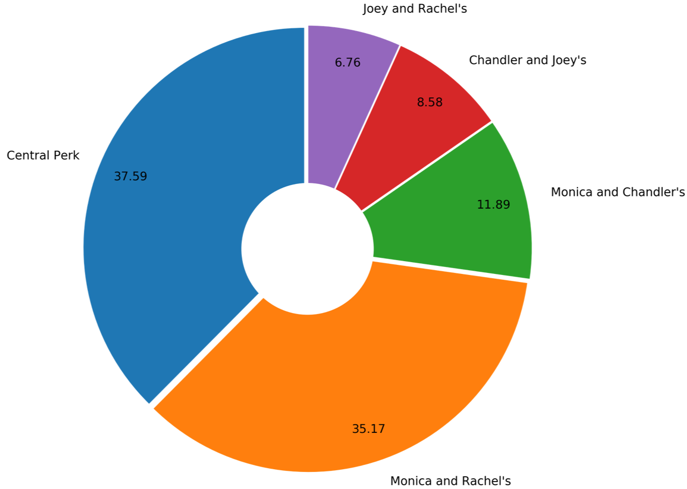
The show did not have much variation in the places it happened. That succeeded in binding its audience to to the show.
## What are the top 5 locations The Big Bang Theory was shot?
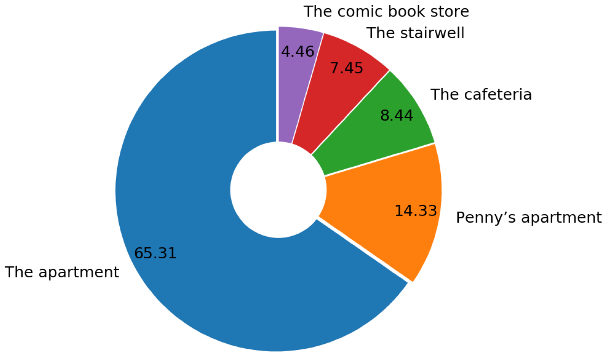
The show did not have much variation in the places it happened. That succeeded in binding its audience to to the show.
## What are the top 5 locations The Breaking Bad was shot?
I did not have data for the Breaking Bad to plot the top 5 locations at this time.


