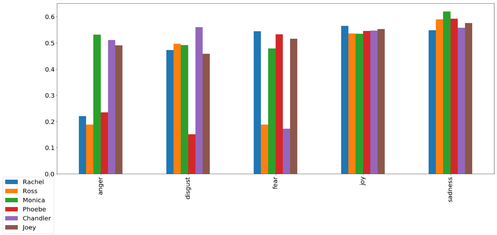

# Can Data Science help us find what makes a hit television show? 

## What constitutes a hit television show like few of these? 
### Questions I asked and investigated through Data Science.

* Is it the consistency in the way individual Characters speak and behave?
* Is it the repeat shots at locations thereby making your audience feel like they know the place over time?
* Is it the similarity/difference in the way different Characters speak and behave?
* Is it the balanced distribution of emotions like joy, sadness, fear, anger, disgust etc. which makes a show interesting?
* Is it the similar/different personality of Characters that keeps the audience connected?
* Is it the interesting flashbacks which binds the audience? 

## Data Availability

* Are datasets available to do this analysis? No

What I got after extensively searching the internet, was the html transcripts from the following URLs.

* Friends - https://fangj.github.io/friends/ - 10 seasons
* The Big Bang Theory – https://bigbangtrans.wordpress.com/ - 10/12 seasons
* Breaking Bad - https://en.wikiquote.org/wiki/Breaking_Bad – 5 seasons (with missing data)

Following is a sample of what these transcripts look like.

Following is a brief illustration of how I prepared dataset for modeling from raw html transcripts.

After I run the above steps, I get my dataset for each sitcom ready to be used for modeling. It took some significant effort on my part to generate these datasets. So, I uploaded them on Kaggle so that they can be used by the interested parties.

https://www.kaggle.com/shilpibhattacharyya/friends-sitcom-dataset

https://www.kaggle.com/shilpibhattacharyya/the-big-bang-theory-dataset

https://www.kaggle.com/shilpibhattacharyya/breaking-bad-sitcom-dataset

I am using **Watson Natural Language Understanding (NLU)** for emotion detection of the characters. Natural Language Understanding is a collection of APIs that offer text analysis through natural language processing. This set of APIs can analyze text to help you understand its concepts, entities, keywords, sentiment, and more. 

 

## Emotion distribution of the Characters on F.R.I.E.N.D.S.
 
## Emotion distribution of the Characters on The Big Bang Theory
 
## Emotion distribution of the Characters on Breaking Bad
 

